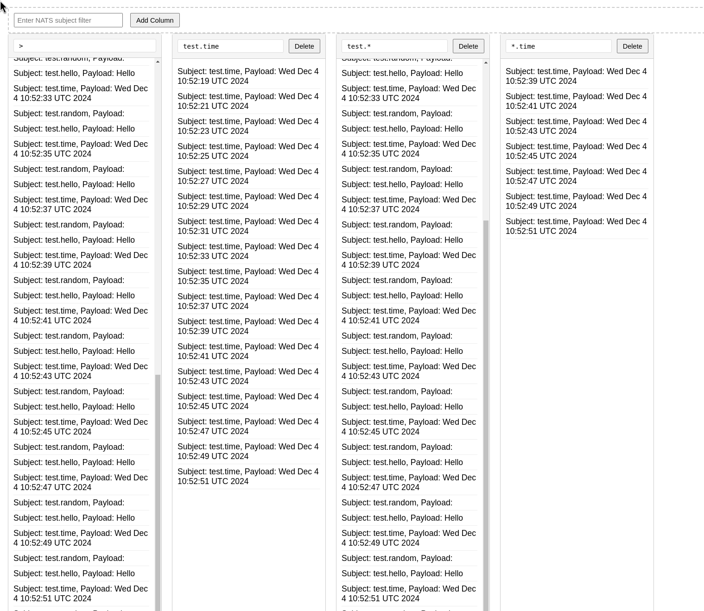

# Simple NATS UI

Simple NATS UI is a strange animal that feeds on a `NATS_URL` environment variable like `nats://localhost:4222` and produces a simple UI like the following:



## Releasing a new version

Bump the version in both the `Cargo.toml` and the `flake.nix` file. Run:

```shell
make build-images
make load-images
make push-images-to-github
```
